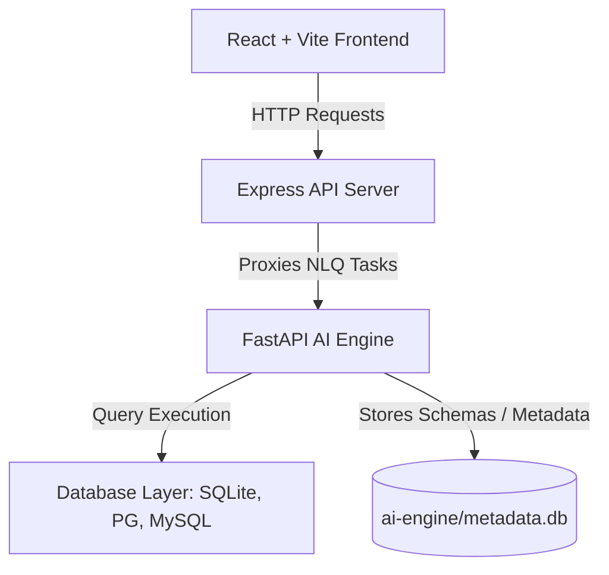

# Voice2Viz AI
### AI-Powered Natural Language Analytics & Visualisation Platform

Voice2Viz AI enables non-technical users to query database engines (SQLite, MySQL, PostgreSQL) using plain English or spoken voice, instantly generating SQL queries, executing them, displaying tabular results, recommending visual charts, and creating AI-driven insights.

---

## Key Features

* **Voice & Text Queries**: Ask questions in plain English or use the microphone button (utilizing Web Speech API) to speak queries.
* **Smart Schema Parsing**: Synchronize table schemas, column types, and foreign key relations into a local catalog.
* **Auto-Visualization**: Analyzes data structures and suggests the best chart type (Bar, Line, Pie, Area, Scatter, Heatmap, or Treemap) with optimal coordinate axes.
* **AI Business Insights**: Highlights key findings, max/min performance indicators, and period-over-period growth metrics.
* **Security & Safe SQL Execution**: Validates generated SQL strictly to prevent destructive commands (blocks `DELETE`, `DROP`, `TRUNCATE`, `ALTER`, `UPDATE`, `INSERT`). Only read-only `SELECT` and `WITH` queries are allowed.
* **Metabase-Style Dashboard Builder**: Create custom dashboards, save generated charts, and rearrange or resize them in a dynamic grid layout.
* **Dual NLP Execution Mode**:
  * **Groq Cloud API**: Uses Llama 3 for intelligent schema matching and insight summaries.
  * **Local Rule-Based Fallback**: Works immediately without API keys, using pattern mapping for testing local sales schemas.

---

## Technical Architecture



---

## Repository Structure

```
voice-to-visualization/
├── frontend/             # React (TypeScript) dashboard client
├── backend/              # Express API node server (manages state and auth)
├── ai-engine/            # Python backend (SQL generator, parser, executor)
│   ├── metadata.db       # Platform database (users, dashboards, widgets)
│   └── sample_sales.db   # Default SQLite sales demo database
└── reports/              # Reports storage directory
```

---

## Local Databases Schemas

### Metadata Catalog Database (`ai-engine/metadata.db`)
Holds the platform credentials, connected database states, parsed schemas, execution histories, saved widgets, and layouts:
* `users`: Account profile credentials and permissions roles.
* `connected_databases`: Connection settings for target servers.
* `schema_metadata`: Columns list, types, primary and foreign key details.
* `query_history`: Executed queries logs, status indicators, and execution timings.
* `visualizations`: Saved chart configurations.
* `dashboards` & `dashboard_widgets`: User-defined widget lists and sizing layout coordinates.
* `ai_insights`: Bulleted text insights.

### Sample Sales Database (`ai-engine/sample_sales.db`)
Includes sample tables (`customers`, `products`, `categories`, `sales`) to explore out of the box.

---

## Step-by-Step Setup Guide

### 1. Launch the Python AI Engine
Open a terminal in the project root:
```bash
cd ai-engine
# Create virtual environment
python -m venv venv
# Activate virtual environment (Windows)
.\venv\Scripts\activate
# Install requirements
pip install -r requirements.txt
# Run FastAPI server
python main.py
```
*The engine runs on port `5000`.*

### 2. Launch the Express.js Backend
Open a second terminal in the project root:
```bash
cd backend
# Install packages
npm install
# Start server
npm start
```
*The Express server runs on port `5001`.*

### 3. Start the React Frontend UI
Open a third terminal in the project root:
```bash
cd frontend
# Install packages
npm install
# Start dev server
npm run dev
```
*The UI will run on `http://localhost:5173`. Open this URL in Chrome, Safari, or Edge.*

---

## Sample Queries to Test

Try entering these questions in the **Query Workspace** after logging in and setting the pre-installed SQLite database as active:

1. **Revenue Trends**: *"Show monthly sales growth"* or *"Show monthly revenue for 2025"*
2. **Product Performance**: *"Show top 10 products by revenue"* or *"Show product inventory stock"*
3. **Demographics**: *"Show customers by city"* or *"Show customers by country"*
4. **Summary Stats**: *"Show total sales overview"*
